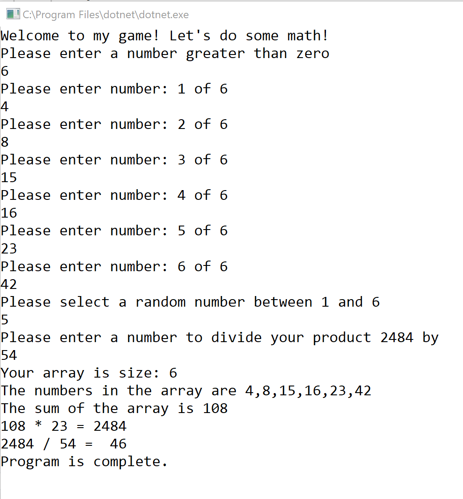

Lab 01: Numbers Game
=====================================

## The Problem Domain
Within a new .NET Core console application, follow the instructions below to create a math game that takes user input, manipulates data, and utilizes error handling, by following the given the specifications. 

## Program Specifications
- Your solution should include the following:
  1. Main Method
  1. StartSequence Method
  1. Populate Method
  1. GetSum Method
  1. GetProduct Method
  1. GetQuotient

## Guidance

Within the `Program.cs` file, add the following methods described below.

Allow the main method to output all generic exceptions. Only define specific exceptions once and pay attention to the callstack on how requests are being made. 

Do not use any "global" variables in this application

### Main Method
This method is given to you. Do not change the method signature. 

1. The "Main" method should be:
	- ***static or instance***: static
	- ***return type***: void
	- ***parameters***: `string[] args`
2. The logic within this method should:
	1. Call the `StartSequence()` method from `Main`.

3. Expected Exceptions:
	1. Generic Exception 
		- Let the user (nicely) know that they did something wrong. 
		- output the message of the exception to the console.

4. Include a `finally` that tells us that the program is completed

### StartSequence Method
1. The "StartSequence" method should be
	- static
	- void return type
	- no parameters
2. The logic within the method should 
	- Prompt the user to "Enter a number greater than zero"
	- Utilize the `Convert.ToInt32()` method to convert the user's input to an integer
	- Instantiate a new integer array that is the size the user just inputted.
	- Call the `Populate` method
		- arguments: integer array.
	- Capture the sum by calling the `GetSum` method. 
		- arguments: integer array 
	- Capture the product by calling the `GetProduct` method. 
		- integer array and integer sum
	- Capture the quotient by calling the `GetQuotient` method. 
		- arguments: integer product 
	- To complete the method, output to the console the details of all these values. Make sure that your output contains the same information presented in the example below. Pay attention to line breaks!
	

3. Exceptions expected: 
	- Format Exception
		- Output the message to the console
	- Overflow Exception
		- Output the message to the console

### Populate Method
1. The "Populate" method should be
	- Static
	- Return type: integer array
	- 1 parameter of an integer array
1. The logic within the method should
	- Iterate through the array and prompt the user to enter a specific number. Example: "Please enter a number 1/6" (indicate to the user what number they are inputting)
	- Utilize the `Convert.ToInt32` method to convert the user's input to an integer (Remember not to directly manipulate the user's input. Store the response into a string first).
	- Add the number just inputted into the array. 
	- Repeat this process until all numbers have been requested and the array is filled. 
	- Return the populated array
1. Expected Exceptions:
	- No expected exceptions. Not even a generic exception. `StartSequence` will already capture your `FormatException` error.

### GetSum Method
1. The method signature of GetSum should contain:
	- ***static or instance***: static
	- ***return type***: integer
	- ***parameters***: integer array
2. the logic within the method should:
	- Declare an integer variable named `sum`
	- Iterate through the array and populate the `sum` variable with the sum of all the numbers together
	- Add the capability to `throw` a custom exception if the sum is less than 20, with the message "Value of {sum} is too low". (replace {sum} with the actual sum of the variable)
	- Return the sum
3. Expected Exceptions:
	- No Try/Catch required since no expected exceptions will be caught. We will have our custom exception be caught in lower levels of the callstack.

### GetProduct Method
1. The method signature of GetProduct should contain:
	- ***static or instance***: static
	- ***return type***: integer
	- ***parameters***: integer array, integer sum
2. The logic within the method should:
	- Ask the user the select a random number between 1 and the length of the integer array. 
	- Declare a new variable named `product`
	- Multiply `sum` by the random number index that the user selected from the array (example: array[randomNumber]). Set this value to the product variable. 
	- Return the product variable. 
3. Expected Exceptions:
	- IndexOutOfRange
		- Output the message to the console.
		- `throw` it back down the callstack so that it displays within `Main`

### GetQuotient
1. The method signature of GetSum should contain:
	- ***static or instance***: static
	- ***return type***: decimal
	- ***parameters***: integer product
1. The logic within the method should
	- Prompt the user to enter a number to divide the product by. Display the current product to the user during this prompt. 
	- Retrieve the input and divide the inputted number by the product. 
	- Utilize the `decimal.Divide()` method to divide the product by the dividend to receive the quotient. 
	- Return the quotient
1. Expected Exceptions:
	- Divide by Zero Exception
		- Output the message to the console
		- Do not throw it back to `Main`
		- Return 0 if the catch gets called

## Stretch Goals
1. Refactor your code and explore different ways to convert user input to integers. (Keep at least 1 Convert.ToInt32, but try and change the rest)

1. Add an additional custom exception into your code base. 

## README
Provide setup documentation 
- **Comment your code.**
- Provide a readme that includes clear directions on setting up this program.
- Questions to Consider: 
	1. What is the purpose of the program?
	1. How do I run the program?
	1. What does the program look like? (visual)

## Rubric

The lab rubric can be found [HERE](../../Resources/rubric){:target="_blank"} 

## To Submit this Assignment
- Create a new repo on your personal GitHub account
- Name your repo `Lab##-TITLE`
- Create a branch named `NAME-LAB##`
- Write your code
- Commit often
- Push to your repository
- Create a pull request from your branch back to master
- Submit a link to your PR in canvas
- In Canvas, Include the actual time it took you to complete the assignment as a comment (**REQUIRED**)
- Include a `README.md` (contents described below)
