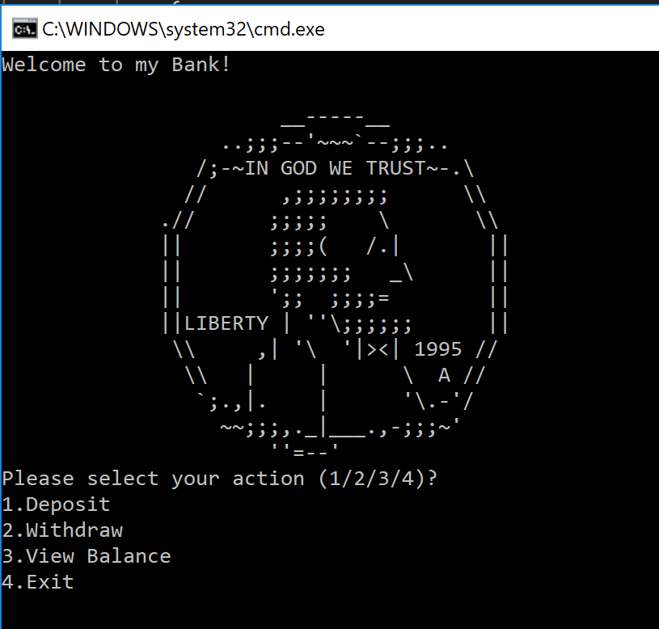

# Bank ATM Teller

**Author**: Your Name(s) Goes Here
**Version**: 1.0.0 (increment the patch/fix version number up if you make more commits past your first submission)

## Overview
ATM Teller is a small program that emulates a Bank ATM Teller. You are given a balance at the intial start of the program, as 
you make more transactions, the balance will vary in value. 

## Getting Started

Follow these instructions to use the Bank ATM Teller

1. Clone down this project to your personal machine
2. Open up the project  by selecting the `sln` file. 
3. Make sure it opens up in your IDE of choice (i reccomend either Visual Studio or VSCode)
4. select Debug -> Start without debugging
5. Play!

## Example
This is the First screen that you will encounter after you start he program. 

### Withdraw
Required Data: A monetary amount you would like to withdraw.  

Possible Errors:
1. "{Amount} is greater than your balance of {Balance}" - the monetary amount you enetered is greater than what you have availalbe in your balance.
2. "Your are trying to withdraw an invalid amount" - Amount is less than or equal to zero.

### Deposit
Depost money into your Account.
Required Data: The Monetary value you would like to deposit

Possible Errors:
1. "Invalid Deposit" - You did not provide a valid amount to withdraw. This could be due to the following:
	 1. The monetary amount you entered is not a valid number
	 2. The monetary amount you entered is equal or less than zero.

### View Balance
Returns the balance of the account.

## Architecture
<!-- Provide a detailed description of the application design. What technologies (languages, libraries, etc) you're using, and any other relevant design information. -->
- Framework: .NET Core 
- Language: C#
- Libraries: System, xUnit

## Change Log

05-11-2018 4:59pm - Scaffold out Program
05-12-2018 9:00pm - Implement Tests