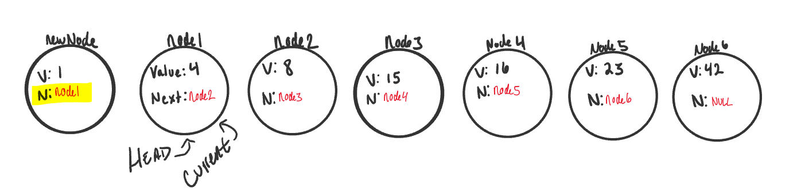

# Linked Lists

## What is a Linked List
A Linked List is a sequence of `Nodes` that are connected/linked to each other. The most defining feature
of a linked List is that each `Node` references the next `Node` in the link. 

## Terminology:
1. *Linked List* - A data structure that contains nodes that links/points to the next node in the list. 
1. *Singly* - Singly refers to the number of references the node has. A `Singly` linked list means that there is only one reference,
and the reference points to the `Next` node in a linked list
1. *Doubly* - Doubly refers to there being two (double) references within the node. A `Doubly` linked list means that there
is a reference to both the `Next` and `Previous` node. 
2. *Node* - Nodes are the individual items/links that live in a linked list. Each node contains the data for each link
3. *Next* - Each node contains a property called `Next`. This property contains the reference to the next node. 
4. *Head* - The Head is a reference type of type `Node` to the first node in a linked list.
5. *Current* - The `Current` reference is a reference type of type `Node` that is currently being looked at. This node is traditionally used when 
traversing through a full linked list. When traversing, you typically reset the current to the head to guarantee you are starting
from the beginning of the linked list. 

## What does it look like

This is what a Singly Linked List looks like


### Adding a Node

Order of operations is extremely important when it comes to working with a Linked List.
What I mean by this is you must be careful that all references to each link/node is properly assigned. 

An example can be with adding a node to a linked list.
If we want to add a node with an `O(1)` efficiency, we have to replace the current `Head` of the linked list with the
new node, without losing the reference to the next node in the list. 

Here are the required steps to add a new node with an O(1) efficiency.

1. Set `Current = Head`. This will guarantee us that we are starting from the very beginning. 
2. We can then instantiate the new node that we are adding. The values passed in as arguments into the `Add()` method
will define what the value of the Node will be. 


3. `newNode.Next` by default is set to `null`. We want to set `newNode.Next` property to the same location that the `Head` node is pointing towards.
Because `Head` is just a reference type, we will be assigning it to the same allocation in memory as the node it is pointing too. In this
case, it's `Node1`. 



4. At this point in the program we now "technically" have `newNode` at the beginning of the linked list, but we are not done yet. 
We now have to re-assign where `Head` is pointing too. Since `node1` is no longer the first node in the list, we want to re-assign `Head` to
point at `newNode`. 

5. While we are at it, let's just re-assign current as well to make sure should any further operation start at the new true start of the
linked list. 


#### Code

Here is the C# code for an `Add` method on a Linked list

```csharp
		public void Add(Node newNode)
		{
			Current = Head;
			newNode.Next = Head;
			Head = newNode;
			Current = Head;
		}
```

#### Big O
Regardless of the number of Nodes that this linked list has, it will always be a O(1) because it takes the same
amount of time to add a new node to the beginning of the list. 

### Traversal

When traversing a linked list, you are not able to use a `foreach` or `for` loop. We depend on the `Next` value
in each node to guide us where the next reference is pointing. The `Next` property is exceptionally important because 
it will lead us where the next node is and allow us to extract the data appropriately. 

The best way to approach a traversal is through the use of a `while()` loop. This allows us to continually check
that the `Next` node in the list is not null. If we accidentally end up trying to traverse on a node that is `null`, 
a `NullReferenceException` gets thrown and our program will crash/end. 

When traversing through a linked list, the `Current` node is the most helpful. The `Current` will tell us 
where exactly in the linked list we are and will allow us to move/traverse forward until we hit the end. 

#### Example
Let's put a use case on our traversal. We want to `Find` the first node that contains a specific value. 

The C# code for a `Find` is as so:

```csharp
		public Node Find(int value)
		{
			Current = Head;

			while (Current.Next != null)
			{
				if (Current.Value == value)
				{
					return Current;
				}
				Current = Current.Next;
			}

			return Current.Value == value ? Current : null;
		}
```

Let's talk out what exactly is happening:
1. We are first resetting `Current` to the `Head` to guarantee we are starting from the beginning.
2. We create a `while` loop. This loop will only run if the `Next` value of the node that `Current` is pointing too
does not have a `null` value in the `Next` property. This also means we can guarantee that we are not looking at the last 
node in a linked list if the while loop is running. 

3. Once we are in the while loop, we are checking if the value of the current node is equal to the value we are looking for. 
Given the logic, if that condition is true, it will then return the node that `Current` is pointing towards and our operation is complete.

4. If the `Current` node does not contain the value we are looking for, we then must move Current to the next node that is 
being referenced. Again, because the condition of this while loop is to only run if we are not at the last node, we can safely 
traverse to the next node without fear of getting a `NullReferenceException`. 

5. At this point, the while loop is re-evaluated. Step 3 & 4 will continue until `Current` reaches the last node of the linked list.
Once this condition becomes true, the while loop breaks, and we now know that we are at the end. 

6. Once we hit the end, we then make a check to see if value of the node that `Current` is pointing towards is the value we are looking for.
If it is, it will return the Current node, else it will return null. 

Notice that the return type for this method is `Node`. `null` is a valid value for a node, so if we end up returning null, we are leaving
it up to whoever asked for this method to run to do additional checking to make sure that they can handle a null node. 


### Print Out Nodes

