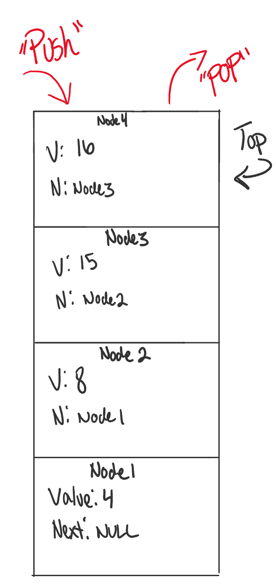

# Stacks and Queues

## What is a Stack

A stack is a data structure that consists of `Nodes`. Each `Node` references the next node in the 
stack, but does not reference it's previous. 

Common terminology for a stack is 
1. *Push* - Nodes or items that are put into the stack are considered to be *pushed*
2. *Pop* - Nodes or items that are removed from the stack are *popped*
3. *Top* - This is the top of the stack.
4. *Peek* - When you `Peek` you will view the `Top` node in the stack. If the stack is empty,
and you don't `Peek', you will recieve a `NullReferenceException`. 

Stacks follow these concepts:
1. **FILO** concept: **F**irst **I**n **L**ast **O**ut.
This means that the first item in the stack, will be the last item out. 

2. LIFO concept: **L**ast **I**n **F**irst **O**ut
This means that the last item in the stack, will be the first item out. 

This is what a stack looks like: 

### Push O(1)

### Pop O(1)

### Peek O(1)

## What is a Queue

Common terminology for a queue is 
1. *Enqueue* - Nodes or items that are put into the stack are considered to be *pushed*
2. *Dequeue* - Nodes or items that are removed from the stack are *popped*
3. *Front* - This is the top of the stack.
4. *Peek* - When you `Peek` you will view the `Top` node in the stack. If the stack is empty,
and you don't `Peek', you will recieve a `NullReferenceException`. 

### Enqueue O(1)

### Dequeue O(1)

### Peek O(1)