# Trees

There are two different types of trees that this tutorial will review:
1. Binary Trees
2. Binary Search Trees

We will review some common terminology that is shared amoungst all of the trees
and then dive into specifics of the different types. 

### Common Terminology

1. *Node* - a node is the individual item/data that make up the data structure.
1. *Root* - The root is the first/top `Node` in a tree 
3. *Left Child* - The node that is positioned to the left of the root
3. *Right Child* - The node that is positioned to the right of the root
1. *Edge* - The edge in a tree is the link between two nodes
1. *Leaf* - A leaf is the node that does not contain either a left child or a right child node. 
1. *Height* - The height of a tree is determined by the number of edges from the root to the bottommost node. 
This is what a tree looks like:

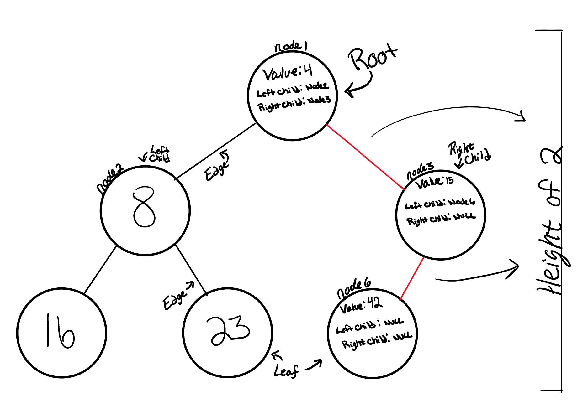


### Traversals

There are two categories of traversals when it comes to trees. 
1. Depth First
2. Breadth First


#### Depth First
Depth first is a traversal that traverses the depth (height) of the tree. 

The different traversals determine at which point the `Root` is looked at. 
Here are the three different depth first traversals broken down:


1. Preorder
   - Root, Left, Right
2. Inorder
   - Left, Root, Right
3. Postorder
   - Left, Right, Root


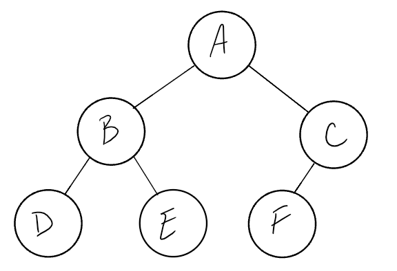


Output:

- ***Preorder:*** A, B, D, E, C, F
- ***Inorder:*** D, B, E, A, F, C
- ***Postorder:*** D, E, B, F, C, A


The most common way to traverse through a tree is to use recursion. 
With these traversals, we rely on the callstack to navigate back up
the tree when we have reached the end. 

Let's breakdown the `PreOrder` traversal.

Here is the code for a PreOrder traversal:

```csharp
public void PreOrder(Node node)
{
    Console.WriteLine(node.Value);

    if(node.LeftChild != null)
    {
        PreOrder(node.LeftChild);
    }

    if(node.RightChild != null)
    {
        PreOrder(node.RightChild);
    }
}
```

1. PreOrder means that the `root` has to be looked at first. 
The first thing we do is look at the root....in our case, we will just ouput that
to the console. When we call `PreOrder` for the first time, the `root`, NodeA, will be added to the callstack. 

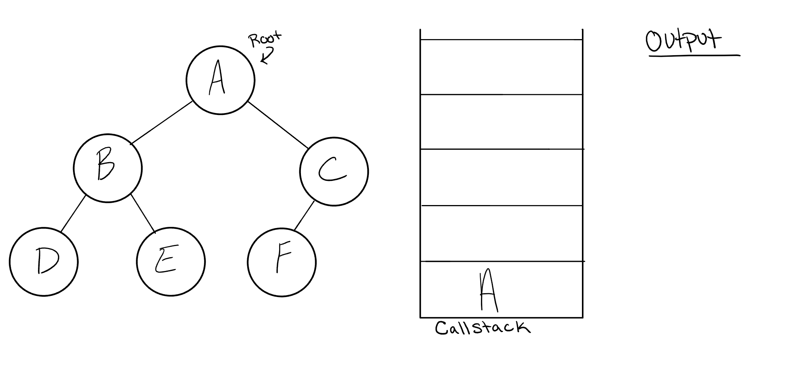

2. Next we start reading the code from top to bottom. The first line of code reads this:

```csharp
    Console.WriteLine(node.Value);
```
 
This means that we will output the `root.Value` out to the console. 

3. Next, the code above is instructing us to check if our `root` has a `LeftChild`.
If the root does, we will then send the `LeftChild` to our PreOrder method recursively. 
`NodeB` is now our new root node, and after this call, `NodeB` is pushed onto the callstack.   

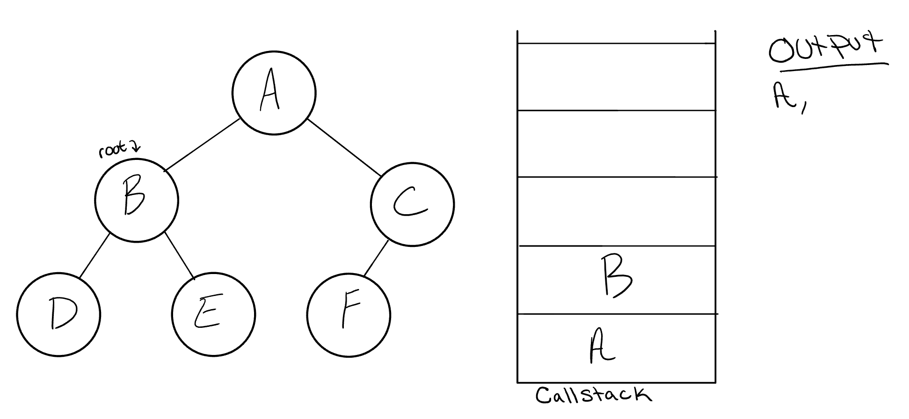


4. This process continues until we reach a `Leaf`. When we do hit a leaf, this is the state of our tree:

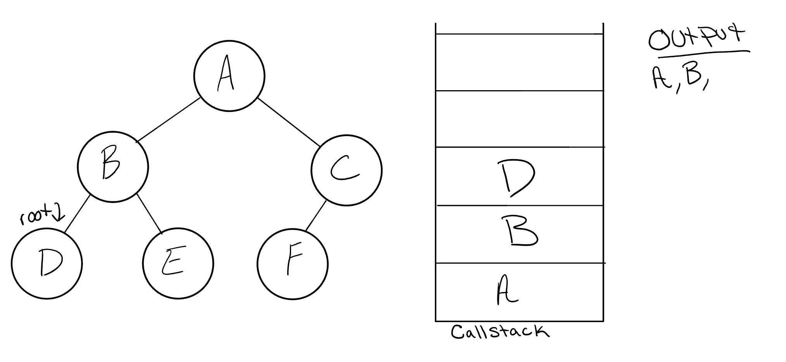

It's important to note a few things that are about to happen. 
  - The value of the node will output to the console.
  - The program will look for both a `node.LeftChild` and a `node.RightChild`. Both will come be false, so it will end the execution of that method call. 
  - `nodeD` wil pop off of the callstack and the root will be reassigned back to `NodeB`.


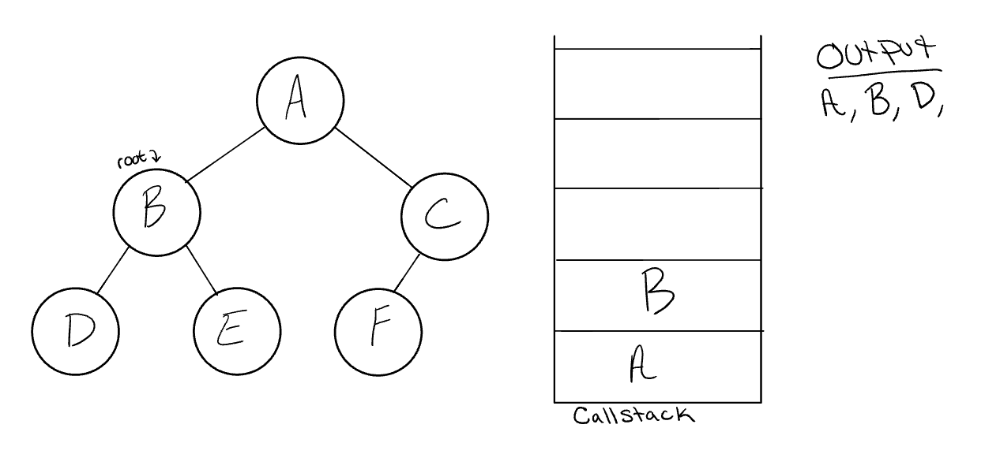

5. The Code block will now pick up where it left off when we were in the `NodeB` frame. 
Since it already looked for `node.LeftChild`, it will now look for `node.RightChild`.

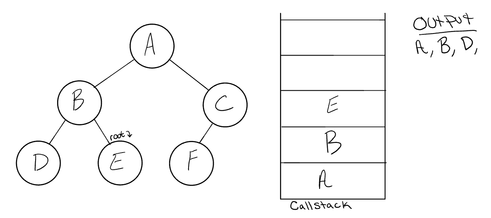

6. `NodeE` will output to the console. Since `NodeE` is a leaf, it will complete the method code 
block, and pop `NodeE` off of the call stack and makes it's way back up to `NodeB`. 
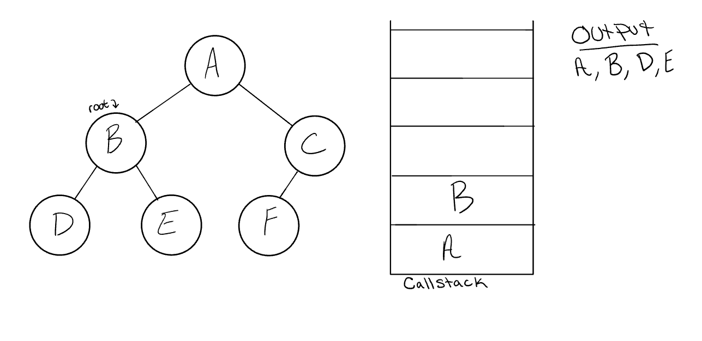

7. In the call frame, `NodeB` has already checked for `node.LeftChild`, and `node.RightChild`, 
the code block will complete and pop off `NodeB` from the callstack, and leave `NodeA` as the root. 
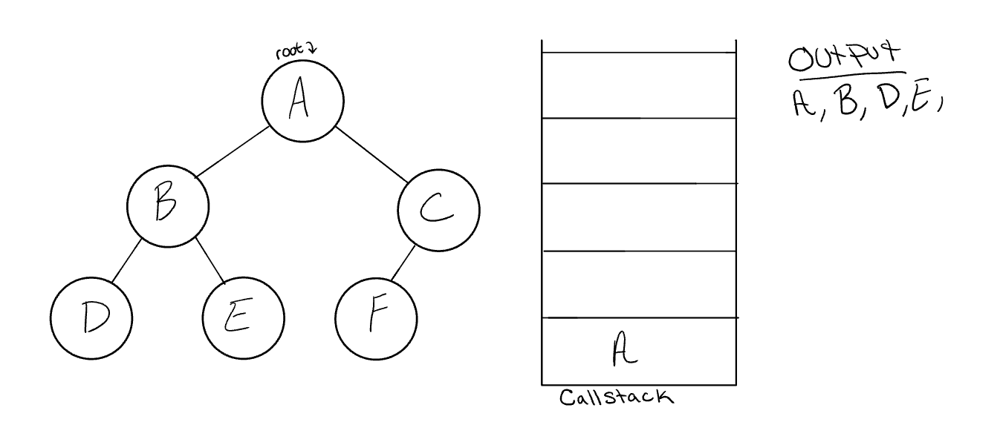

8. Following the same pattern as we did with the other nodes, `NodeA`'s callstack frame will pick up where it left off, and check out `Node.RightChild`. 
`NodeC` will be added to the callstack frame, and it will now be reassigned as the new root. 

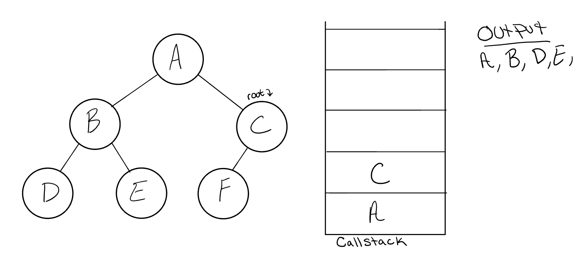

9. `NodeC` will be outputted to the console, and `node.LeftChild` will be evaluated, and `PreOrder()` will be called sending `node.LeftChild` as it's root. 

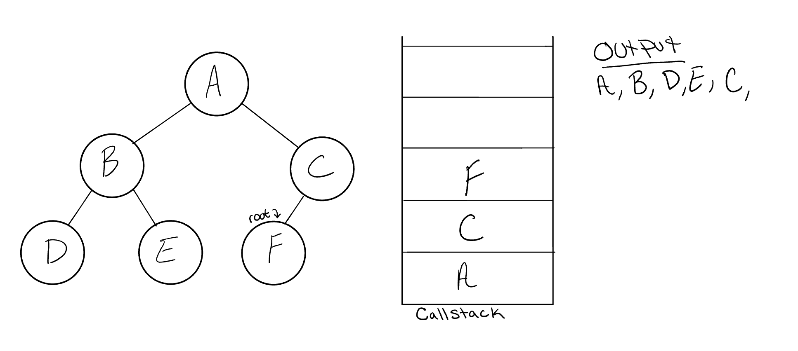

10. At this point, the program will find taht `NodeF` does not have any children and it will make it's way back up the call stack up to `NodeC`. 

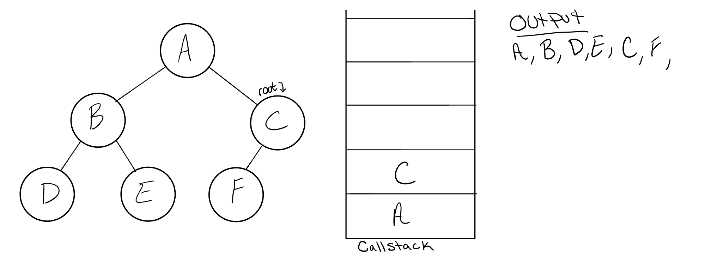


11. NodeC does not have a `node.RightChild`, so it will pop off the callstack and return to Node A. 

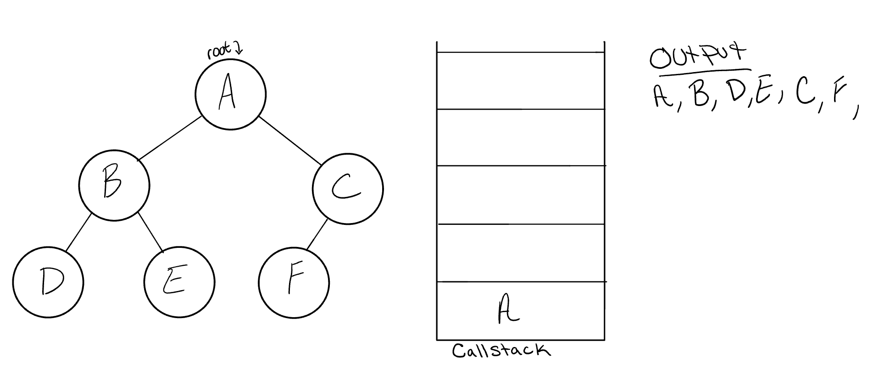


12. Congratulations! Your PreOrder traversal is completed!


Here is the C# code for all 3 of the depth first traversals.

```csharp
public void PreOrder(Node node)
{
    Console.WriteLine(node.Value);

    if(node.LeftChild != null)
    {
        PreOrder(node.LeftChild);
    }

    if(node.RightChild != null)
    {
        PreOrder(node.RightChild);
    }
}
```

```csharp
public void InOrder(Node node)
{
    if(node.LeftChild != null)
    {
        InOrder(node.LeftChild);
    }

    Console.WriteLine(node.Value);

    if(node.RightChild != null)
    {
        InOrder(node.RightChild);
    }
}
```

```csharp

public void PostOrder(Node node)
{
    if(node.LeftChild != null)
    {
        PostOrder(node.LeftChild);
    }

    if(node.RightChild != null)
    {
        PostOrder(node.RightChild);
    }

    Console.WriteLine(node.Value);

}

```

Notice the similarities between the three different traversals above.
The biggest difference between each of the traversals is ***when you are looking
at the root node***. 


#### Breadth First
The breadth first traversal iterates through the tree by
going through each level of the tree node by node. 

***Output:*** A, B, C, D, E, F


Traditionally the breadth first traversal leverages a queue to
traverse the width (or the breadth) of the tree. Let's break down 
the process:

1. First, Let's take a look at a tree that we can conduct a Breadth First traversal on:


2. Let's start by putting the root Node into the queue (`Queue.Enqueue(root`)


3. Now that we have one node in our queue, let's `Dequeue` the node, and `Enqueue` both 
it's `root.LeftChild` and it's `root.rightChild`. 


4. We will repoeat this process until we have traversed the whole tree in it's entirety. 


## Binary Trees

Binary Trees are trees that only contain numbers. This is not restricted
to just `ints`, but can extend out to other numeric types such as `decimal`, `double`, `float`, etc...

There is not a specific sorting order for a binary tree. When adding a node to a binary tree,
you are not restricted on the node's location. 

Here is an example of a binary tree:


The height of this tree is 2. The height of the tree is determined 
by the number of edges that start at the root, and go down to the last leaf. 

### Adding a node

When adding a node to a binary tree, we will leveraage the use of the breadth first traversal. 

During the traversal, we will find the first node that does not have a left or right child node, and insert
the new node in it's place. 

Here is the code for adding a Node:

```csharp
public void Add(Node root, int value)
{
    queue.Enqueue(root);
    while(queue.Peek != null)
    {
       Node node = queue.Dequeue();
       
       if(node.Left != null)
       {
            queue.Enqueue(node);
       } else {
            node.Left = new Node(value);
            
        }

       if(node.Right != null)
       {
            queue.Enqueue(node);
       } else {
            node.Right = new Node(value);
            
        }
    }
}
```


### Finding a node

When finding a node within a Binary Tree, you want to conduct 
a traversal that will allow you to visit all of the nodes in the binary tree
until the desired node is found. 

In these situations, any of the traversals that we have reviewed so far will work 
when attempting to find a node. 

Here is a coding example of a PreOrder traversal that is searching for a specific node:

```csharp
public Node Find(Node node, int value)
{
    if(node.value == value)
    {
        return node; 
    }

    if(node.LeftChild != null)
    {
        PreOrder(node.LeftChild);
    }

    if(node.RightChild != null)
    {
        PreOrder(node.RightChild);
    }
}
```

#### Big O
The Big O of a find in regular Binary Tree is O(n). 
This means that in the worst case scenario, the node that is currently trying to be found 
either does not exist in the tree, or is the very last node to be traversed. 

## Binary Search Trees
A binary search tree


### Adding a node


//Big O

### Finding a node 

// Big O


