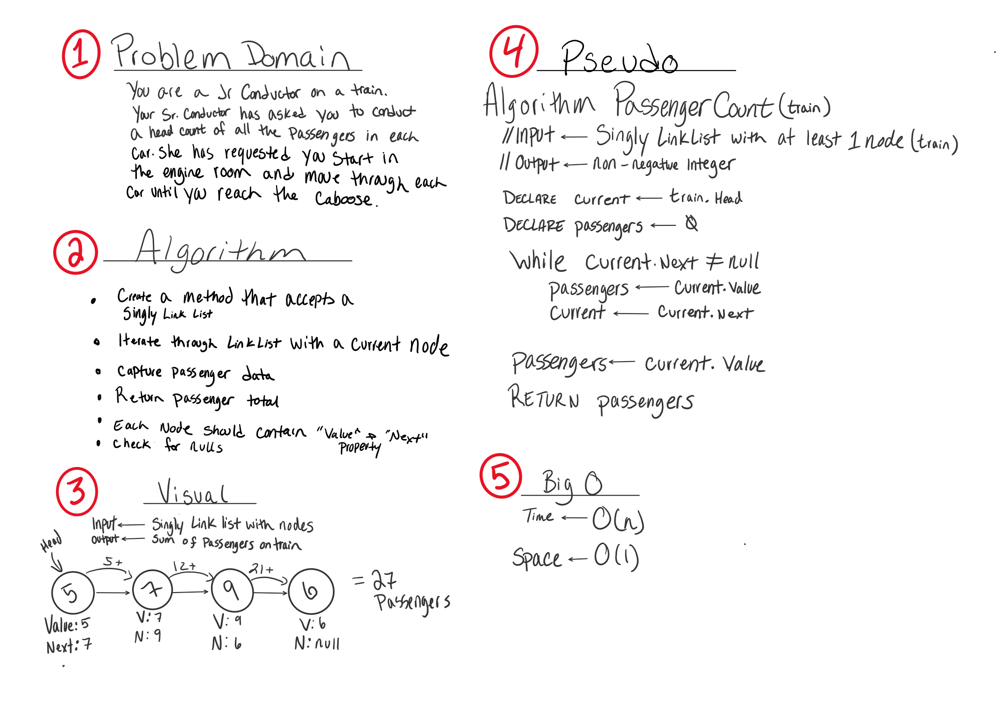

# Whiteboard Challenge Workflow

This file contains details on what is expected when completing a whiteboard challenge. Please refer to the visual as a guideline 
to what content is required for each whiteboarding challenge.

## 1. Problem Domain
Re-iterate the problem domain that you have been asked. This can be done either verbatim from the initial question, or a summary in your own words, whatever makes more sense to you. 

## 2. Algorithm
The Algorithm is a breakdown of what you need to achieve. This should be a bulleted list or a general overview of what your final pseudo code should consist of

## 3. Visual
Draw out what the problem domain and visually solve the problem. Label all of the appropriate properties, define your input and output, and show how you will approach the problem towards a solution. 

## 4. Pseudo
Write out your pseudo code! Use the (pseudo code cheat sheet)[] as a guideline to the expectation. 

## 5. Big O
Determine what space/time efficiency of the algorithm that you just created. 

## 6. Test
Make sure to walk through both the problem domain and your solution to make sure that it both works and is efficient. 