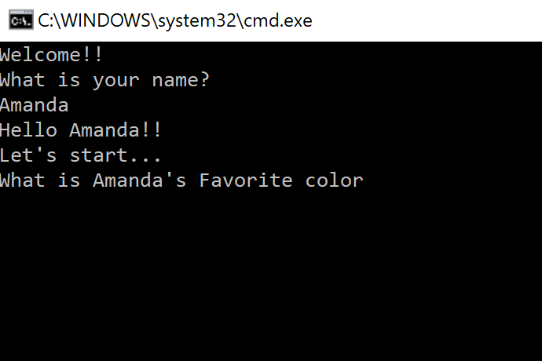

# About Me Quiz

## What is it
This is a quiz game to test your knowledge about how well you know me!
There are 5 simple questions. Some are multiple choice, while others are free text!
Be careful, some may be tricky!

## What does it look like
Here a screenshot of the inital launch of the application. 
The game is command line based, so all you have to do is type right into your command line. 

## How do you use it
Follow these instructions to start playing the game. 

1. Clone down this project to your personal machine
2. Open up the project  by selecting the `sln` file. 
3. Make sure it opens up in your IDE of chocie (i reccomend either Visual Studio or VSCode)
4. select Debug -> Start without debugging
5. Play!

## More Details
Have fun!!