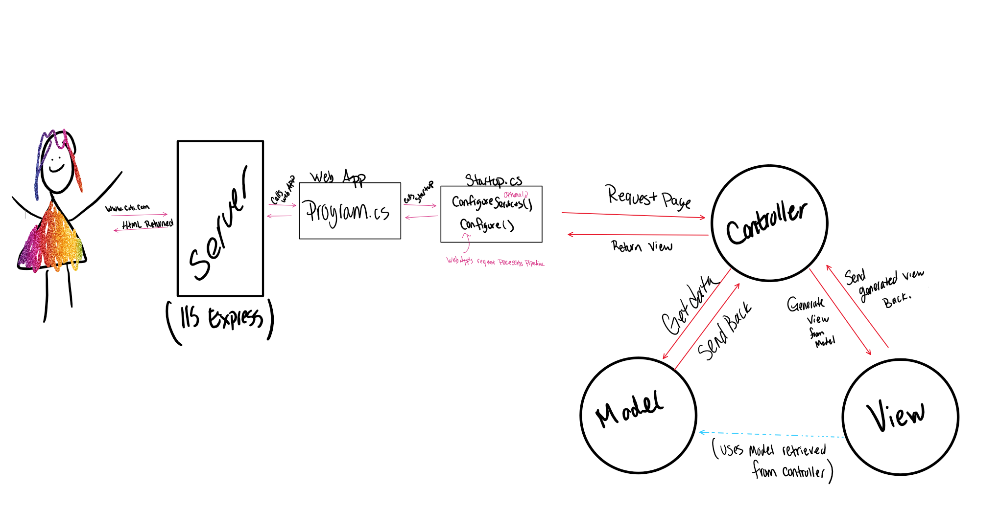

# Facilitators Guide: Introduction to Databases and ERDs

## Overview

This is the first day that the students will dive into the "Async Inn Inventory Management" website. Do not show the students the wire frames or resources for the site just yet. Make sure they complete the ERD for this lab assignment before showing them what they will be building.

### How does this topic fit?

**Where we've been**:
To this point, the students have a solid foundation in C# language fundamentals, but have not yet built a full application.

**What are we focusing on today**:
Today primarily focuses on an introduction to databases. This should be a combination of review from 301, as well as some new content such as composite keys and join tables.

**Where we're headed**:
Next class will focus on creating the scaffolding for an MVC application that will use an ERD to work with a live database.

## Learning Objectives

Review the detailed objectives in today's [student-facing readme](../README.md).

> Our primary outcomes and goals for the day are ... (use this pull quote to call out any instructor facing notes/outcomes that need toe highlighted)

## Preparation

- If you are unfamiliar with Databases and their relationships, a good place to start is [Here](https://www.tutorialspoint.com/dbms/index.htm)
- Review the MSFT docs for complex data models [Here](https://docs.microsoft.com/en-us/aspnet/core/data/ef-mvc/complex-data-model?view=aspnetcore-2.0)
  - Start from the Overview and work your way through the whole tutorial if you can.
- Review the [ERD](../resources/databases.md) and [SQL](../resources/sql.md) resources to assist with details. These are to be provided to students as well.

## Lecture Outline

### Code Review

No Code Review Today, this is the start of a new module

### Topic 1: MVC Applications

- **Why** (5 min)
  - Standardization and familiarity for developers
  - Source trees that follow a common convention and format are easy to consume
- **What** (5 min)
  - Models: Data/Tables/Business Rules
  - Controllers: What do we do, how does it get done (Traffic Cop)
  - Views: Presenting data to the user
    - JSON
    - HTML
    - Reporting
    - Native app
- **How** (5 min)
  - In .NET we use an MVC framework and ORMs to assist the process
  - Do a brief overview image to show the concept
  - For the next couple of classes, we'll be focusing on the Models

### Topic 2: Databases (Models)

- **Why** (5 min)
  - Apps are largely meaningless without persistence
  - User Lists so you can login and find your friends
  - Banking History
- **What** (10 min)
  - A database is a set of related information, stored
  - Generally indexed so we can find things fast
  - Generally grouped by related information/types
    - Users, Posts, Likes, etc, ...
  - Generally describes relationships between data types
    - i.e. Users might make Posts
  - There are 2 types of databases: SQL (Relational) and NoSQL (Document)
    - Relational, Table Based DBs are well suited to an OOP Framework
      - Classes can be seen as tables, which ties code and logic right to a DB
      - Vertically scaled
    - NoSQL Databases are shapeless, document stores
      - Excellent for non-schematic data
      - Horizontally scaled
- **How** (30 min)
  - Start to map out pros and cons of each database type

### Topic 3: ERDs

- **Why** (5 min)
  - Proper Planning!
  - Database Tables::Classes
    - Need to know the relationships ahead of development
- **What** (10 min)
  - ERD Is a visual design construct
  - Entity Relationship Diagram
  - Definitions
    - Relations
      - 1:1
      - 1:Many
      - Many:Many
      - Many:1
    - Keys
      - Primary Keys (Unique Keys to our table)
      - Foreign Keys (References primary keys in other tables)
      - Composite Keys
- **How** (30 min)
  - In-Class exercise to build out ERD for any problem domain you'd like to talk through
  - The [demo](./DEMO.md) has good overview of a sample problem domain along with talking points about working with ERD tooling
- **Experimentation and Discovery Ideas**
  - Have the students break off into groups and implement a student enrollment system
  - 20-30 minute exercise
  - [Instructions](../demo/school.md)
  - Allow them to struggle with that and then do a quick review of one team's work

## Lab Notes

Put your students into teams of 3 for today's planning lab. They will be on their own through the next series of labs to implement the group design.

This lab will require that the students create an ERD and also create a scaffold template of their Hotel API application with an empty database.

This ERD portion of this lab is timed (4 Hours Max) and is effort based. They should be able to read through the problem domain and come up with an ERD for the database as well as provide an explanation. You will provide and review the solution with them at the start of the next class.

## What might students struggle with today?

- Nothing major. Overall ERDs are straight forward to break down.
- Adding in a DbContext to your application is mostly convention.

## Past bugs, issues or surprises...

- Database key relationships for composite keys are brand new. Foreign and primary keys are review.

## General Comments and Notes

- Spend the last 45 minutes to an hour of lecture time having the students attempt to make an ERD based off of the problem domain (located in the bottom of the `Database.md` file) and review the results.

- Spend a few minutes  reviewing the requirement. Have the students group off and attempt the ERD (20 minutes or so), and spend the last 15 having the students present their ideas and reviewing the solution.

Be sure to share this solution with the students, as that is what our demo for the next few days will be tied to.

Stress to them that there is more than "one right answer", this is just one possible way.
