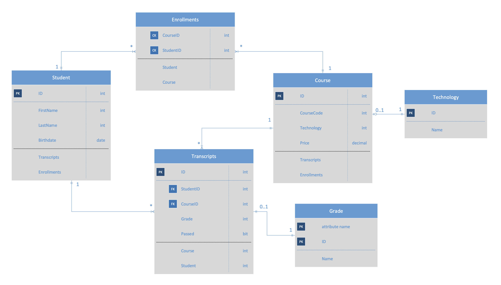

# Demos: Navigation Properties and Routing

Use this document to describe the demo(s). Generally, this is going to take the format of either how to build the demo step by step, or less specifically, talking points surrounding the outcomes of the demo segment and code snippets to highlight.

## School Demo



### Add some data

Prior to starting the demo, add some records to the Student, Course, and Technology tables so that as we start joining things, the connections will be made.

## Review

1. Show and discuss the ERD
1. Models are the "Boxes"
1. We turn these into tables using Migration Scripts
1. Handling user requests:
   - These trigger the controller routes
   - It is given the correct service (repository)
   - Service has the DbContext methods wrapped
   - Route runs service methods
   - Service methods use context to talk to the DB
   - Route returns the data
1. Wiring
   - We use dependency injection to "feed" each system (controller, etc) the correct subystem or dependency

## Goals for this demo:

1. Wire up the "lines" between the entities in the ERD
   - We want our request for a student to give us their courses too
   - We want our request for a course to give a list of students
   - We want our transcripts for a student to include the student and course detail

How?

1. Alter the models to include "Navigation Properties" (these are the lines)
1. Alter the services to make the additional calls to get related data
1. Create CRUD methods for the join tables
1. Create a new Interface/Service/Controller for the payload join table, which is a special case


### Add the Enrollments Table

This will implement the enrollment entity (the box in the drawing, or the table in our db)

- Add Enrollment as a DbSet in the Context
- If you migrate (try it), you'll get an error because there's no primary key (id)
  - The actual primary key should be the composite key: StudentId + CourseId
  - This can be handled in the DbContext:
  ```csharp
  // This creates the composite primary key for the enrollments table
  modelBuilder.Entity<Enrollment>().HasKey(
    // Create a new "anonymous" type (like a JS object)
    enrollment => new { enrollment.CourseId, enrollment.StudentId }
  );
  ```
- Once you migrate and update the database, inspect the migration class to see the new PK constraint as well as the table itself

### Add the connections

Once we have the enrollments table, use **Navigation Properties** to connect it to the others (implementing the "lines" in the ERD)

#### Navigation properties for the join table

- In the Enrollment class, add your Navigation Properties:

  ```csharp
  // Navigation Properties
  // These specify the link between these tables
  public Student Student { get; set; }
  public Course Course { get; set; }
  ```
- Run a migration and update
- Inspect the migration class to see the new foreign keys being created

> Notice that it "figured out" how to hook the `id` fields up. This is done by convention. `StudentId` is mapped to the `id` column in the `students` table by the framework automatically

If you now browse to the table in SQL Explorer, you can add some rows manually that tie students and courses together in the enrollments table.
  - What happens if you try and add a bad student or course id?
    - Error: Referential Integrity fails on the constraint!


#### Reverse Navigation Properties for the "Source" tables

> The demo below focuses on **Student** ... it can be (and should be) repeated for **Courses**, as there's a many:many relationship there as well

```csharp
// Student Class
public List<Enrollment> Enrollments {get; set; }
```

If you now restart your server and browse to `/api/students/1`, you'll see that enrollments is there, but null

```json
{
  "id": 1,
  "firstName": "Fred",
  "lastName": "Sanford",
  "dateOfBirth": "1968-09-12T00:00:00",
  "enrollments": null
}
```

#### Engage the live connections

Target: http://localhost:port/api/students/1

We'll want to alter our `GetOne()` and `GetAll()` methods to include the relevant data from the join table, instead of `null`

This requires an alteration to the service, in the GetOne method, adding a query to hook up the enrollments from the join table

Code this up a few times.

1. As below, but without the `.Include()` ... what comes in for the `enrollments`? (null)
1. Add in the `.Include()` and see how the enrollments are now a part of the data
1. Finally, comment all of that out, and do it with a LINQ query.
   - Discuss.
   - Rather than 2 separate queries as we just did, we can have Entity Framework optimize ONE query, which is more effieicnt

```csharp
public async Task<Student> GetOne(int id)
{
  // look in the db on the student table, where the id is equal to the id that was brought in as an argument
  Student student = await _context.Students.FindAsync(id);

  // Find and then Include all of the enrollments that the student has
  var enrollments = await _context.Enrollments.Where(x => x.StudentId == id)
                                         .Include(x => x.Course)
                                         .ToListAsync();
  student.Enrollments = enrollments;

  return student;

  // Replace the above with this LINQ query to do it all in a single lookup
   return await _context.Students
                        .Include(s => s.Enrollments)
                        .ThenInclude(e => e.Course)
                        // .Include(s => s.Transcripts)  // If you've added transcripts Navigation Prop and data
                        // .ThenInclude(t => t.Course)
                        .FirstOrDefaultAsync(s => s.Id == id)
}

```

If you try to load a student in the browser, you should encounter a Cycle error when you try and load a student in a route. Why?

It's loading a student, with an enrollment, that has a student id, with an enrollment, that has a student id, with an enrollment .... we need to make it target only the course once, and will need to install and configure a new dependency

To fix this, we need to install a new dependency:

**Microsoft.AspNetCore.Mvc.NewtonsoftJson** *Be aware of version incompatibilities*

Once the package is installed, add this to your Startup.cs Configuration to ignore the cycle and give us proper data

```csharp
services.AddControllers().AddNewtonsoftJson(options =>
  options.SerializerSettings.ReferenceLoopHandling = Newtonsoft.Json.ReferenceLoopHandling.Ignore
);
```

Following this change, you should be able to browse to a student by id and see their enrollments. Additionally, you can apply the same logic on the Course side of things and have the course present a list of student enrollments (see CourseRepository.cs)


### Manage the Join-Table Data with code (CRUD)

Now, we've been able to manually go to the database and add records to the Enrollments table to test out our basic wiring. Let's add a code path to have our Controllers be able to do this for us using a route.

#### Add an enrollment using our ICourse Interface and CourseRepository

ICourse.cs

```csharp
Task AddStudent(int studentId, int courseId);
```


CourseRepository.cs
```csharp
public async Task AddStudent(int studentId, int courseId)
{

  Enrollment enrollment = new Enrollment()
  {
    CourseId = courseId,
    StudentId = studentId
  };

  _context.Entry(enrollment).State = EntityState.Added;
  await _context.SaveChangesAsync();

}
```

#### Add a route in our CoursesController to let us add a student to a course

We want /api/courses/5/6, which would represent course 5 and student 6

```csharp
// POST: api/Courses/{CourseId}/{StudentId}
// "Model Binding" -- looks at the request and maps those to method params
[HttpPost]
[Route("{courseId}/{studentId}")]
public async Task<IActionResult> AddStudentToCourse(int courseId, int studentId)
{
  await _course.AddStudent()
  return NoContent();
}
```

#### Delete will work similarly

ICourse.cs

```csharp
Task RemoveStudentFromCourse(int courseid, int studentId);
```


CourseRepository.cs
```csharp
public async Task RemoveStudentFromCourse(int courseId, int studentId)
{
  // Find me the record where the course and student match our request
  var result = await _context.Enrollments.FirstOrDefaultAsync( x => x.CourseId == courseId && x.StudentId == studentId);

  _context.Entry(result).State = EntityState.Deleted;

  await _context.SaveChangesAsync();

}
```

CoursesController.cs
```csharp
public async Task RemoveStudentFromCourse(int courseId, int studentId)
{
  // Find me the record where the course and student match our request
  var result = await _context.Enrollments.FirstOrDefaultAsync(x => x.CourseId == courseId && x.StudentId == studentId);

  _context.Entry(result).State = EntityState.Deleted;

  await _context.SaveChangesAsync();

}

```

### Transcripts -- Join Table with Payload

- This is going to need
  - A Model
    - Navigation Properties for Course and Student
  - An Interface
    - Note to change the delete to require both course and student
  - A Repository
